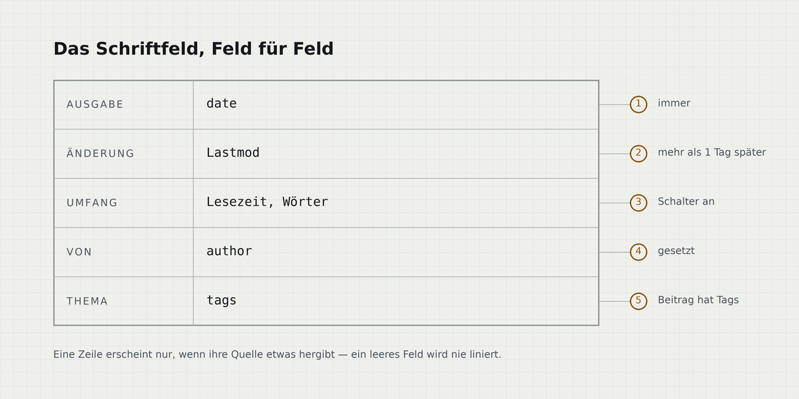

+++
title = "Ein Blatt lesen"
date = 2026-01-15T10:00:00+01:00
lastmod = 2026-02-03T09:20:00+01:00
draft = false
tags = ["referenz", "typografie"]
summary = "Was das Schriftfeld festhält, warum die Lesespalte breiter ist als üblich empfohlen — und wann das Blatt gar nichts zeichnet."
translationKey = "reading-a-sheet"

[cover]
  alt = "Ein Zeichnungsblatt: Rahmen, Zonenleiste mit Buchstaben, Schriftfeld unten rechts"
  caption = "Das Blatt, leer. Alles Weitere ist ein Feld darauf."
+++

Jede Seite dieses Themes ist ein Zeichnungsblatt. Der linierte Block unter dem Titel ist das
**Schriftfeld**: Auf einer echten technischen Zeichnung steht darin, was das Blatt zeigt, wer es
gezeichnet hat, wann, und in welchem Änderungsstand. Hier trägt es dieselben Felder — als wirkliche
Tabelle mit Rahmen, nicht als graue Bildunterschrift, über die der Blick ohnehin hinweggeht.

## Was im Schriftfeld steht

Jede Zeile speist sich aus genau einem Front-Matter-Schlüssel. Eine Zeile, die nichts zu sagen hat,
wird gar nicht erst liniert — ein leeres Feld ist auf einer Zeichnung ein Mangel, kein Platzhalter.



Dieser Beitrag hat ein `lastmod`, das mehr als einen Tag nach `date` liegt — deshalb erscheint die
Zeile **Änderung**. Nimmt man den Schlüssel heraus, verschwindet die Zeile und der Block schließt
sich darüber.

| Feld | Quelle | Erscheint |
|---|---|---|
| Ausgabe | `date` | immer |
| Änderung | `Lastmod` | bei mehr als einem Tag Unterschied zu `date` |
| Umfang | Lesezeit, Wortzahl | wenn die Schalter an sind |
| Von | `author` | wenn gesetzt |
| Thema | `tags` | wenn der Beitrag Tags hat |
| Auch auf | Übersetzungen | wenn es den Beitrag in einer anderen Sprache gibt |

## Die Lesespalte

Die Spalte fasst bei 20px Grundschrift **92 Zeichen** — deutlich mehr als die klassische Empfehlung
von 65 bis 75. Das ist ein bewusster Tausch für technische Texte, deren eigentlicher Inhalt Befehle
und Terminalausgaben sind, die nicht umbrechen sollen:

```console
$ hugo --gc --minify
Start building sites …

                  │ EN │ DE
──────────────────┼────┼────
 Pages            │ 24 │ 21
 Processed images │  6 │  6

Total in 211 ms
```

Den Preis dafür trägt die Zeilenhöhe: Bei `1.75` bleibt auch eine 92 Zeichen lange Zeile verfolgbar,
und der Rücksprung landet zuverlässig in der richtigen Reihe. Beide Werte sind an einer gesetzten
Zeile gemessen, nicht geschätzt — eine Hochrechnung über Zeichen pro Pixel geht verlässlich daneben.

> [!NOTE]
> Geschrieben als gewöhnliches Markdown-Zitat, das mit `[!NOTE]` beginnt. Kein Shortcode und kein
> rohes HTML — was deshalb zählt, weil Goldmarks `unsafe` ausgeschaltet ist.

## Die Zonenleiste

Der Streifen mit den Buchstaben am linken Rahmenrand ist keine Zierde. Jeder Buchstabe steht für
eine Überschrift erster Ebene in diesem Beitrag, und jeder ist ein Link. Auf einer Seite, die nichts
zu indizieren hat, wird die Leiste nicht gezeichnet — ein beschriftetes leeres Feld wäre eine
Behauptung über die Zeichnung, die nicht stimmt.

> [!WARNING]
> Breite Tabellen scrollen in einem eigenen Container, statt die ganze Seite seitwärts zu schieben.
> Probiere die Tabelle oben in einem schmalen Fenster aus.
