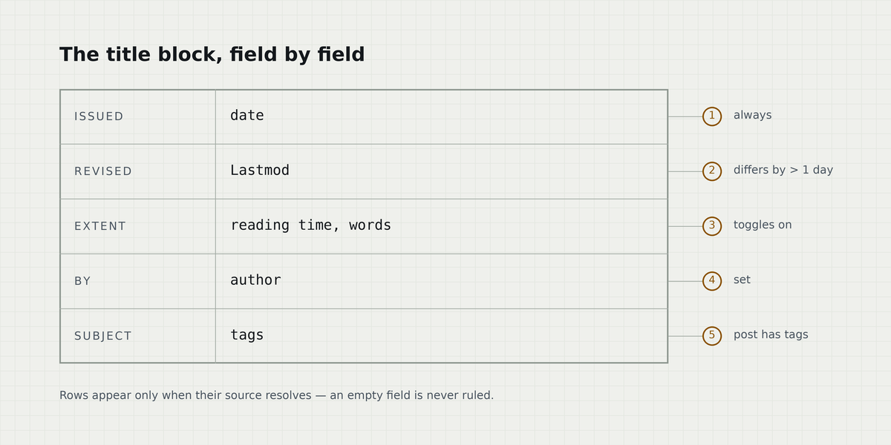

+++
title = "Reading a Sheet"
date = 2026-01-15T10:00:00+01:00
lastmod = 2026-02-03T09:20:00+01:00
draft = false
tags = ["reference", "typography"]
summary = "What the title block records, why the reading column is wider than the usual advice, and how the sheet decides what to draw."
translationKey = "reading-a-sheet"

[cover]
  alt = "A drawing sheet: ruled frame, lettered zone rail, title block in the bottom right"
  caption = "The sheet, empty. Everything below is a field on it."
+++

Every page in this theme is a drawing sheet. The ruled block under the title is the **title block**:
on a real drawing it states what the sheet is, who drew it, when, and at which revision. Here it
carries the same fields, as an actual bordered table rather than a grey caption line that the eye
skips on its way to the first paragraph.

## What the title block records

Each row is fed by one front matter key, and a row that has nothing to say is not ruled at all — an
empty field on a drawing is a defect, not a placeholder.



The post you are reading has a `lastmod` more than a day after its `date`, which is why it shows a
**Revised** row. Remove that key and the row disappears; the block closes up around it.

| Field | Source | Shown when |
|---|---|---|
| Issued | `date` | always |
| Revised | `Lastmod` | it differs from `date` by more than a day |
| Extent | reading time, word count | `ShowReadingTime` / `ShowWordCount` |
| By | `author` | the key is set |
| Subject | `tags` | the post has tags |
| Also in | translations | the post exists in another language |

## The reading column

The column runs to **92 characters** at the 20px body size, well past the classic 65–75 advice. That
is a deliberate trade for technical writing, where the substance is command blocks and terminal
output that should not wrap:

```console
$ hugo --gc --minify
Start building sites …

                  │ EN │ DE
──────────────────┼────┼────
 Pages            │ 24 │ 21
 Processed images │  6 │  6

Total in 211 ms
```

The line height carries the cost of that width: at `1.75` a 92-character line stays trackable, and
the return sweep still lands on the right row. Both numbers were measured from a rendered line
rather than estimated — a characters-per-pixel guess is reliably wrong.

> [!NOTE]
> Written as a plain Markdown blockquote opening with `[!NOTE]`. No shortcode and no raw HTML, which
> matters because Goldmark's `unsafe` is off.

## The zone rail

The lettered strip down the left edge of the frame is not decoration. Each letter is one top-level
heading in this post, and each is a link. On a page with nothing to index — a profile page, a short
note — the rail does not render, because lettering an empty field would be a lie about the drawing.

> [!TIP]
> The rail follows `##` headings only. If a post reads as one continuous argument, give it no
> sections and it gets no rail.

## Alerts

Five kinds, all plain Markdown:

> [!IMPORTANT]
> Notes and tips carry the signal amber; warnings and cautions carry the danger colour. Only one
> *interactive* mark is ever live at a time — one active nav item, one focus ring, one lit zone. An
> alert classifies a passage rather than competing for the click, so it does not count against that.

> [!WARNING]
> A wide table scrolls inside its own container rather than pushing the page sideways. Try the one
> above on a narrow window.

> [!CAUTION]
> Colour is never the only carrier: every alert is labelled in words as well.
